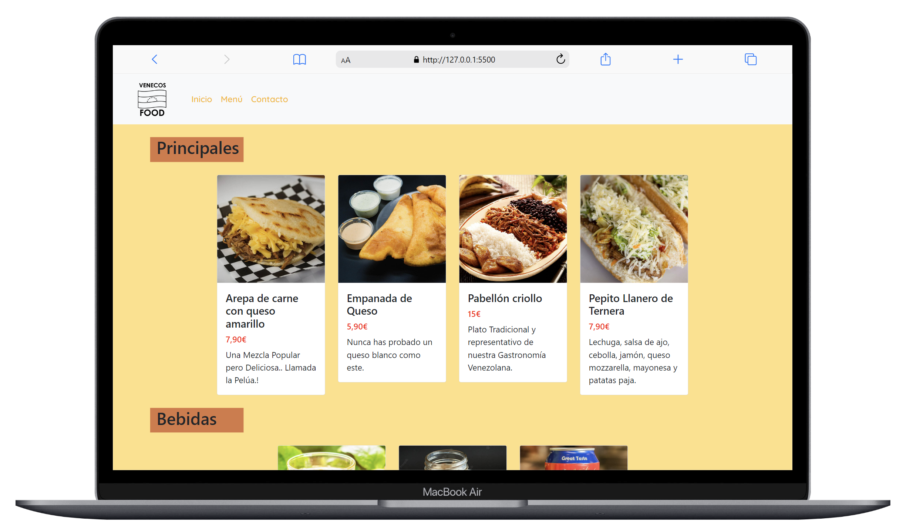
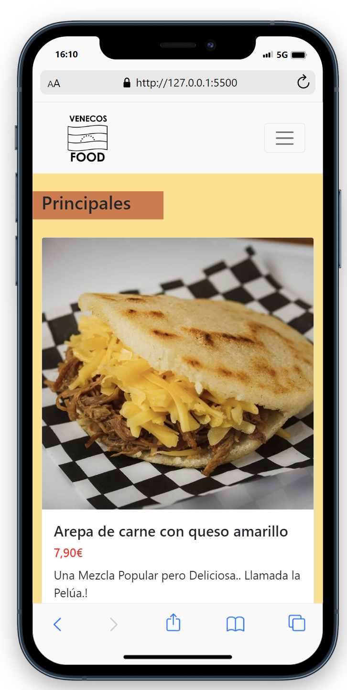

# Welcome to my menu

## Objective 🎯
Demonstrates knowledge and usage of rows and columns using bootstrap in html

## About the project 🔎
I decided to make a web page where I show a menu of typical food from Venezuela, where we can move through Navarra and choose if we want to be at the beginning, menu or contact the restaurant 
  

## Stack

 

## Views
Desktop view
  
Mobile view

## License
This project is under license from Luis Guerrero

## Webgrafia:
To achieve my goal I have collected information from:

## Thanks to:

To the profesor Fidel Gilart

## Contacto

 

